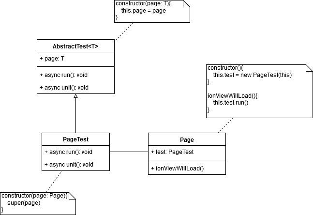

# Teste Automatizado com Ionic

Aplicativo de teste da ideia discutida no artigo https://medium.com/@tfccomputation/testes-automatizados-com-ionic-sem-framework-de-teste-b840795e904

O texto mostra um padrão para criar testes automatizados sem uso de framework. O padrão discutido está ilustrado no diagrama abaixo. Ver artigo citado para mais detalhes.

## Como executar este exemplo?

Primeiro passo é clonar o projeto
        
	$ git clone https://github.com/tfccomputation/ionictest.git

Segundo passo é instalar as dependencias

	$ cd ionictest
    $ npm install

Finalmente, execute o projeto

	$ ionic serve
    $ ionic cordova run android